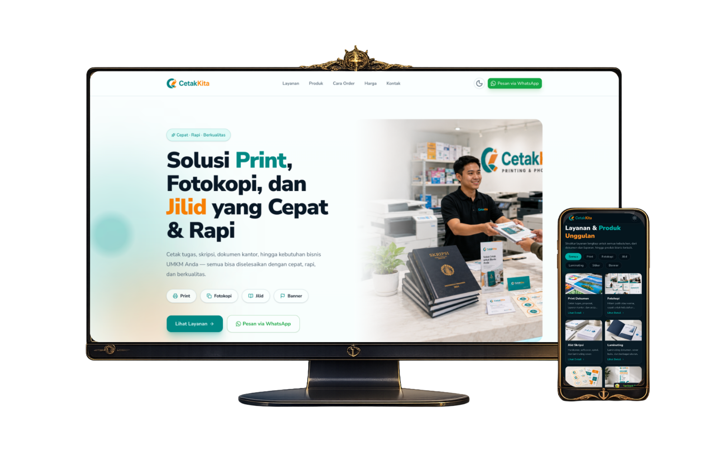

# CetakKita - Printing Service Landing Page

CetakKita adalah landing page modern untuk bisnis percetakan, fotokopi, jilid, banner, stiker, dan layanan dokumen. Website ini dirancang sebagai storefront digital yang memudahkan pelanggan melihat layanan, memahami alur order, membaca FAQ, melihat testimoni, dan langsung melakukan pemesanan lewat WhatsApp.

## Preview



## Project Context

Project ini dibuat sebagai portfolio frontend dengan workflow AI-assisted development. Referensi tampilan dieksplorasi menggunakan ChatGPT, asset visual dibuat menggunakan ChatGPT Image 2.0, lalu implementasi websitenya dibangun dengan full vibe coding berdasarkan referensi dan asset tersebut.

Fokus utamanya adalah menghasilkan website bisnis yang terlihat polished, responsif, informatif, dan siap dipresentasikan sebagai studi kasus portfolio.

## Key Features

- Hero section dengan CTA ke daftar layanan dan WhatsApp.
- Katalog layanan dengan filter kategori.
- Grid produk populer untuk kebutuhan percetakan.
- Paket mahasiswa untuk kebutuhan skripsi dan proposal.
- Alur order step-by-step dari upload file sampai ambil atau antar.
- Benefit layanan seperti respon cepat, preview sebelum cetak, revisi, dan same day service.
- Testimonial carousel otomatis.
- FAQ, kontak, lokasi, dan CTA WhatsApp.
- Dark mode dengan animated theme toggle.
- Responsive layout untuk desktop dan mobile.

## Tech Stack

- **React 19** - UI component layer.
- **TanStack Start** - App framework dan SSR-ready structure.
- **TanStack Router** - Type-safe file-based routing.
- **TypeScript** - Type safety untuk komponen dan data UI.
- **Tailwind CSS 4** - Styling, responsive layout, dan custom theme token.
- **shadcn/ui** - Komponen UI seperti button, card, badge, accordion, dan carousel wrapper.
- **Motion** - Loading animation, reveal animation, dan transition.
- **Embla Carousel** - Testimonial carousel.
- **Lucide React** - Icon system.

## AI-Assisted Assets

Asset visual pada project ini dibuat untuk membangun identitas visual CetakKita secara konsisten, termasuk:

- Hero image storefront percetakan.
- Product images untuk layanan print, jilid, banner, stiker, proposal, dan kebutuhan bisnis.
- Ilustrasi langkah order.
- Ilustrasi benefit layanan.
- Customer service dan testimonial visuals.
- Preview mockup desktop dan mobile.

Seluruh asset tersebut digunakan sebagai bagian dari eksplorasi workflow ChatGPT Image 2.0 dan vibe coding untuk membangun website portfolio yang cepat namun tetap rapi secara visual.

## Project Structure

```txt
src/
  components/
    ui/                 # Reusable UI components
  lib/                  # Shared utilities
  routes/               # TanStack Router routes
  server/               # Server functions
  styles.css            # Global styles, Tailwind setup, theme tokens

public/
  preview-project.png   # Project preview image
  *.png                 # AI-generated visual assets
```

## Getting Started

Install dependencies:

```bash
pnpm install
```

Run development server:

```bash
pnpm dev
```

Build for production:

```bash
pnpm build
```

Preview production build:

```bash
pnpm preview
```

## Portfolio Notes

Project ini cocok ditampilkan sebagai studi kasus:

- AI-assisted frontend development.
- Landing page untuk bisnis lokal.
- Responsive UI implementation.
- Conversion-focused website design.
- Visual asset generation using ChatGPT Image 2.0.
- Full vibe-coding workflow from reference to implementation.
